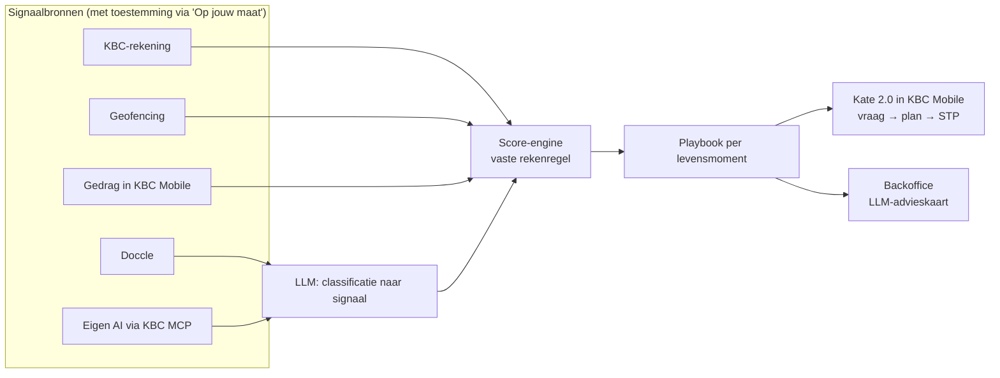

# KBC Momentum

**Het levenslandschap dat meedenkt.** KBC Momentum ziet een nieuw levensmoment aankomen voordat de klant erom vraagt. Kate 2.0 staat dan klaar met één gebundeld plan, dat grotendeels via Straight-Through Processing verloopt.

> *"Vandaag ziet KBC de kinderbijslag. Met KBC Momentum ziet KBC maanden eerder dat er een kindje op komst is, en staat Kate klaar nog voor Tom en Lien erom vragen."*

Team **in4matics** · Tectonic Hackathon · KBC-challenge · september 2026

---

## In één oogopslag

| | |
|---|---|
| **Probleem** | KBC ziet een levensmoment pas wanneer het al gebeurd is: een geboorte via de kinderbijslag, een huis via de notaris. Dan is het vaak al te laat om te helpen. |
| **Oplossing** | Het hoofdscherm van KBC Mobile wordt een getekend landschap van het leven van de klant. Signalen uit vier bronnen bouwen per levensmoment een score op. Bij 70% vraagt Kate *"Klopt dit?"*, na bevestiging volgt een plan in één tik. |
| **Voor KBC** | Een backoffice die voor alle 2,3 miljoen klanten toont welke levensfase start, met scenario, volgende beste actie, kanaal en toon. |
| **Waarom het werkt** | ~40 levensmomenten met elk een playbook. De score is een vaste en uitlegbare rekenregel. De LLM personaliseert enkel de laatste stap. |

---

## Het probleem

1. **KBC is te laat.** Het levensmoment wordt pas zichtbaar via een betaling achteraf. Tegen dan heeft de klant zijn verzekering, spaarrekening of lening misschien al elders geregeld.
2. **De klant heeft geen overzicht.** Polissen, rekeningen en documenten zitten verspreid over schermen en apps. De klant weet niet wat goed geregeld is en waar er gaten zitten.
3. **Het moet schalen.** Het moet werken voor meer dan 2,3 miljoen klanten, zonder dat iemand elk dossier manueel opvolgt.

## De oplossing: het levenslandschap

Elk element in het landschap staat voor een levensdomein: 🏠 huis · 👪 gezin · 🚗 auto · ☂️ bescherming · 🌳 sparen en beleggen · ☀️ gezondheid · ⛺ reizen.

| Markering | Betekenis |
|---|---|
| ✅ Vinkje | Dit domein is goed geregeld bij KBC |
| ❓ Vraagteken | Kate ziet een gat of een kans |
| ⭕ Gestippelde figuur met gloed | Er is een nieuw levensmoment op komst |

Onderaan staat de balk **"Vraag het je wereld"**, met chips per domein die Kate openen voor dat domein. Zo wordt personalisatie zichtbaar in plaats van een onzichtbaar algoritme.

## Demo: Tom en Lien verwachten een kindje

Tom en Lien zijn allebei 32. Ze hebben een huis met een KBC-woonkrediet en een auto die bij KBC verzekerd is. Kinderen hebben ze nog niet.

1. **Signalen komen binnen.** In de backoffice stijgt de score voor *Gezinsuitbreiding* signaal per signaal.
2. **Het landschap verandert.** Bij 70% verschijnt een gestippeld vierde figuurtje. Kate vraagt zacht: *"Klopt het dat jullie gezin groter wordt?"*
3. **Kate doet een voorstel.** Na bevestiging volgt één gebundeld gezinsplan, afgestemd op wat ze al hebben.

---

## Hoe het werkt



### Signalen (demo Tom en Lien)

| Week | Bron | Signaal | Gewicht |
|---|---|---|---|
| 7 | Eigen AI via KBC MCP | Lien vraagt: "Wat moeten we regelen als we een kindje verwachten?" | 0,35 |
| 10 | Doccle | Afschrift van een gynaecoloog (enkel het label, nooit de inhoud) | 0,60 |
| 12 | Geofencing | Twee bezoeken aan de praktijk van een vroedvrouw | 0,20 |
| 14 | KBC Mobile | Pagina's over hospitalisatie en kinderspaarrekening bekeken | 0,15 |
| 16 | KBC-rekening | Drie aankopen in een babyspeciaalzaak | 0,25 |
| 18 | KBC-rekening | Inschrijvingsgeld kinderopvang | 0,45 |
| 20 | KBC-rekening | Prenatale cursus | 0,20 |

Eén signaal zegt weinig. De combinatie van bronnen tilt de score al in week 10 over de drempel en uiteindelijk tot **94%**.

### De rekenregel

Elk signaal verkleint de kans dat er "niets aan de hand is". Oudere signalen wegen minder (halveringstijd 60 dagen):

$$\text{score} = 1 - \prod_{i} \left(1 - w_i \cdot 0{,}5^{\,t_i / 60}\right)$$

*w* is het gewicht van het signaal, *t* is de leeftijd van het signaal in dagen. **De LLM beslist nooit over de score.** Hij zet enkel ongestructureerde data (een document, een AI-vraag) om in een signaal. Zo kan KBC altijd uitleggen waarom een moment gedetecteerd werd.

### Drempels

| Score | Klant ziet | Backoffice ziet |
|---|---|---|
| < 40% | Niets | Het signaal in de tijdlijn |
| 40–70% | Enkel nuttige info, geen verkoop | "Moment in opbouw", scenario staat klaar |
| 70–90% | Gestippelde figuur en de vraag "Klopt dit?" | Aanbevolen actie, toon en kanaal |
| > 90% en bevestigd | Gebundeld voorstel in één tik, via STP | Automatisch afgehandeld, adviseur enkel bij uitzondering |

### Wat Kate voorstelt

| Voorstel | Hoe het verloopt |
|---|---|
| Kindje meeverzekeren in de hospitalisatieverzekering | STP, één tik |
| Familiale verzekering (BA) nakijken | STP, automatische check |
| Spaarrekening of beleggingsplan op naam van het kind | STP, één tik |
| Gezinsbudget en simulatie van ouderschapsverlof | Info en simulatie in de app |
| Begunstigden levensverzekering en schuldsaldo nakijken | Kate zet het klaar, adviseur bevestigt |
| Groeipakket en geboortepremie (Beyond Banking) | Checklist met links naar de overheid |
| Kate Coin-geboortebonus | Smart contract: wordt vrijgegeven bij de opening van de kinderspaarrekening en de registratie van de geboorte |

---

## Trust en privacy

Vertrouwen is een ontwerpkeuze, geen beperking.

- **Toestemming per bron** via *'Op jouw maat'*. Zonder toestemming is er geen signaal.
- **Gezondheidsdata blijft een label** (GDPR art. 9). De tool bewaart "prenatale opvolging", nooit de medische inhoud.
- **Eerst vragen, dan voorstellen.** Bij gevoelige momenten volgt nooit automatisch een commercieel voorstel. Kate feliciteert pas na bevestiging.
- **"Waarom zie ik dit?"** Bij elk moment staan de signalen die meespeelden. De klant kan zeggen "klopt" of "niet voor mij", of het moment wissen.
- **De eigen AI leest nooit mee.** Via de KBC MCP-server gaat enkel het moment door (*"gezinsuitbreiding, oriënterend"*), niet het gesprek. Uitvoering gebeurt altijd in KBC Mobile.

## Link met de KBC-pijlers

| Pijler | Rol in KBC Momentum |
|---|---|
| **Kate 2.0** | Intentgestuurde voorstellen, voert acties uit na akkoord |
| **Straight-Through Processing** | Meeverzekeren, rekening openen en BA-check zonder menselijke tussenkomst |
| **Beyond Banking** | Groeipakket, geboortepremie en kinderopvang in het gezinsplan |
| **Kate Coin 2.0** | Geboortebonus als smart contract met een voorwaarde |
| **KMO & Business Dashboard** | Dezelfde engine herkent zakelijke momenten (start van een zaak, eerste werknemer) |
| **Trust & Privacy** | 'Op jouw maat', uitleg bij elk moment, Engelbewaarder-logica bij gevoelige momenten |

---

## Het prototype (4 uur bouwtijd)

Een klikbaar front-end met **twee schermen** en **echte LLM-calls**. Al de rest draait op mockdata.

| Onderdeel | Route | Echt of gesimuleerd |
|---|---|---|
| Levenslandschap (KBC Mobile) | `/app` | React + SVG, gestuurd door de score |
| Kate-paneel | `/app` | Echte LLM-call, met fallback |
| Backoffice-klantfiche + advieskaart | `/backoffice` | Live score, LLM-call voor de kaart |
| Signaalbronnen | — | Mockdata in JSON |
| KBC MCP-koppeling | — | Gesimuleerde tool-call-kaart |

**Stack:** Lovable (React, TypeScript, Tailwind, shadcn/ui) · inline SVG · score-engine in de browser · edge function voor de LLM (de API-sleutel blijft server-side) · `BroadcastChannel` om beide schermen te synchroniseren.

**Uitgangspunten:** de demo werkt ook offline dankzij opgeslagen LLM-antwoorden (`src/data/fallback.json`). De score is deterministisch. We werken met één persona en één moment, perfect uitgewerkt.

**Buiten scope:** echte koppelingen met KBC-systemen, Doccle of geofencing, authenticatie, echte STP- en Kate Coin-transacties.

### Projectstructuur

```
src/
├── types.ts            # Klant, Signaal, Moment, Playbook
├── store.ts            # gedeelde demo-state
├── lib/score.ts        # score-engine (rekenregel)
├── hooks/useLevensverhaal.ts   # speelt signalen week per week af
└── data/
    ├── klant.json      # Tom en Lien
    ├── signalen.json   # signalen per bron
    ├── playbook.json   # gezinsplaybook
    └── fallback.json   # opgeslagen LLM-antwoorden
```

---

## Documentatie

- 📘 [KBC Momentum – Het levenslandschap dat meedenkt](https://github.com/in4matics-tectonic/docs/wiki/KBC-Momentum-%E2%80%93-Het-levenslandschap-dat-meedenkt): het functionele verhaal
- 🛠️ [KBC Momentum – Technisch document](https://github.com/in4matics-tectonic/docs/wiki/KBC-Momentum-%E2%80%93-Technisch-document): de bouwhandleiding (datamodel, prompts, MCP, taakverdeling)

> Alle klanten, cijfers en signalen in dit project zijn fictief en dienen enkel voor de demo.
# KBC Momentum

**Het levenslandschap dat meedenkt.** KBC Momentum ziet een nieuw levensmoment aankomen voordat de klant erom vraagt. Kate 2.0 staat dan klaar met één gebundeld plan, dat grotendeels via Straight-Through Processing verloopt.

> *"Vandaag ziet KBC de kinderbijslag. Met KBC Momentum ziet KBC maanden eerder dat er een kindje op komst is, en staat Kate klaar nog voor Tom en Lien erom vragen."*

Team **in4matics** · Tectonic Hackathon · KBC-challenge · september 2026

---

## In één oogopslag

| | |
|---|---|
| **Probleem** | KBC ziet een levensmoment pas wanneer het al gebeurd is: een geboorte via de kinderbijslag, een huis via de notaris. Dan is het vaak al te laat om te helpen. |
| **Oplossing** | Het hoofdscherm van KBC Mobile wordt een getekend landschap van het leven van de klant. Signalen uit vier bronnen bouwen per levensmoment een score op. Bij 70% vraagt Kate *"Klopt dit?"*, na bevestiging volgt een plan in één tik. |
| **Voor KBC** | Een backoffice die voor alle 2,3 miljoen klanten toont welke levensfase start, met scenario, volgende beste actie, kanaal en toon. |
| **Waarom het werkt** | ~40 levensmomenten met elk een playbook. De score is een vaste en uitlegbare rekenregel. De LLM personaliseert enkel de laatste stap. |

---

## Het probleem

1. **KBC is te laat.** Het levensmoment wordt pas zichtbaar via een betaling achteraf. Tegen dan heeft de klant zijn verzekering, spaarrekening of lening misschien al elders geregeld.
2. **De klant heeft geen overzicht.** Polissen, rekeningen en documenten zitten verspreid over schermen en apps. De klant weet niet wat goed geregeld is en waar er gaten zitten.
3. **Het moet schalen.** Het moet werken voor meer dan 2,3 miljoen klanten, zonder dat iemand elk dossier manueel opvolgt.

## De oplossing: het levenslandschap

Elk element in het landschap staat voor een levensdomein: 🏠 huis · 👪 gezin · 🚗 auto · ☂️ bescherming · 🌳 sparen en beleggen · ☀️ gezondheid · ⛺ reizen.

| Markering | Betekenis |
|---|---|
| ✅ Vinkje | Dit domein is goed geregeld bij KBC |
| ❓ Vraagteken | Kate ziet een gat of een kans |
| ⭕ Gestippelde figuur met gloed | Er is een nieuw levensmoment op komst |

Onderaan staat de balk **"Vraag het je wereld"**, met chips per domein die Kate openen voor dat domein. Zo wordt personalisatie zichtbaar in plaats van een onzichtbaar algoritme.

## Demo: Tom en Lien verwachten een kindje

Tom en Lien zijn allebei 32. Ze hebben een huis met een KBC-woonkrediet en een auto die bij KBC verzekerd is. Kinderen hebben ze nog niet.

1. **Signalen komen binnen.** In de backoffice stijgt de score voor *Gezinsuitbreiding* signaal per signaal.
2. **Het landschap verandert.** Bij 70% verschijnt een gestippeld vierde figuurtje. Kate vraagt zacht: *"Klopt het dat jullie gezin groter wordt?"*
3. **Kate doet een voorstel.** Na bevestiging volgt één gebundeld gezinsplan, afgestemd op wat ze al hebben.

---

## Hoe het werkt


### Signalen (demo Tom en Lien)

| Week | Bron | Signaal | Gewicht |
|---|---|---|---|
| 7 | Eigen AI via KBC MCP | Lien vraagt: "Wat moeten we regelen als we een kindje verwachten?" | 0,35 |
| 10 | Doccle | Afschrift van een gynaecoloog (enkel het label, nooit de inhoud) | 0,60 |
| 12 | Geofencing | Twee bezoeken aan de praktijk van een vroedvrouw | 0,20 |
| 14 | KBC Mobile | Pagina's over hospitalisatie en kinderspaarrekening bekeken | 0,15 |
| 16 | KBC-rekening | Drie aankopen in een babyspeciaalzaak | 0,25 |
| 18 | KBC-rekening | Inschrijvingsgeld kinderopvang | 0,45 |
| 20 | KBC-rekening | Prenatale cursus | 0,20 |

Eén signaal zegt weinig. De combinatie van bronnen tilt de score al in week 10 over de drempel en uiteindelijk tot **94%**.

### De rekenregel

Elk signaal verkleint de kans dat er "niets aan de hand is". Oudere signalen wegen minder (halveringstijd 60 dagen):

$$\text{score} = 1 - \prod_{i} \left(1 - w_i \cdot 0{,}5^{\,t_i / 60}\right)$$

*w* is het gewicht van het signaal, *t* is de leeftijd van het signaal in dagen. **De LLM beslist nooit over de score.** Hij zet enkel ongestructureerde data (een document, een AI-vraag) om in een signaal. Zo kan KBC altijd uitleggen waarom een moment gedetecteerd werd.

### Drempels

| Score | Klant ziet | Backoffice ziet |
|---|---|---|
| < 40% | Niets | Het signaal in de tijdlijn |
| 40–70% | Enkel nuttige info, geen verkoop | "Moment in opbouw", scenario staat klaar |
| 70–90% | Gestippelde figuur en de vraag "Klopt dit?" | Aanbevolen actie, toon en kanaal |
| > 90% en bevestigd | Gebundeld voorstel in één tik, via STP | Automatisch afgehandeld, adviseur enkel bij uitzondering |

### Wat Kate voorstelt

| Voorstel | Hoe het verloopt |
|---|---|
| Kindje meeverzekeren in de hospitalisatieverzekering | STP, één tik |
| Familiale verzekering (BA) nakijken | STP, automatische check |
| Spaarrekening of beleggingsplan op naam van het kind | STP, één tik |
| Gezinsbudget en simulatie van ouderschapsverlof | Info en simulatie in de app |
| Begunstigden levensverzekering en schuldsaldo nakijken | Kate zet het klaar, adviseur bevestigt |
| Groeipakket en geboortepremie (Beyond Banking) | Checklist met links naar de overheid |
| Kate Coin-geboortebonus | Smart contract: wordt vrijgegeven bij de opening van de kinderspaarrekening en de registratie van de geboorte |

---

## Trust en privacy

Vertrouwen is een ontwerpkeuze, geen beperking.

- **Toestemming per bron** via *'Op jouw maat'*. Zonder toestemming is er geen signaal.
- **Gezondheidsdata blijft een label** (GDPR art. 9). De tool bewaart "prenatale opvolging", nooit de medische inhoud.
- **Eerst vragen, dan voorstellen.** Bij gevoelige momenten volgt nooit automatisch een commercieel voorstel. Kate feliciteert pas na bevestiging.
- **"Waarom zie ik dit?"** Bij elk moment staan de signalen die meespeelden. De klant kan zeggen "klopt" of "niet voor mij", of het moment wissen.
- **De eigen AI leest nooit mee.** Via de KBC MCP-server gaat enkel het moment door (*"gezinsuitbreiding, oriënterend"*), niet het gesprek. Uitvoering gebeurt altijd in KBC Mobile.

## Link met de KBC-pijlers

| Pijler | Rol in KBC Momentum |
|---|---|
| **Kate 2.0** | Intentgestuurde voorstellen, voert acties uit na akkoord |
| **Straight-Through Processing** | Meeverzekeren, rekening openen en BA-check zonder menselijke tussenkomst |
| **Beyond Banking** | Groeipakket, geboortepremie en kinderopvang in het gezinsplan |
| **Kate Coin 2.0** | Geboortebonus als smart contract met een voorwaarde |
| **KMO & Business Dashboard** | Dezelfde engine herkent zakelijke momenten (start van een zaak, eerste werknemer) |
| **Trust & Privacy** | 'Op jouw maat', uitleg bij elk moment, Engelbewaarder-logica bij gevoelige momenten |

---

## Het prototype (4 uur bouwtijd)

Een klikbaar front-end met **twee schermen** en **echte LLM-calls**. Al de rest draait op mockdata.

| Onderdeel | Route | Echt of gesimuleerd |
|---|---|---|
| Levenslandschap (KBC Mobile) | `/app` | React + SVG, gestuurd door de score |
| Kate-paneel | `/app` | Echte LLM-call, met fallback |
| Backoffice-klantfiche + advieskaart | `/backoffice` | Live score, LLM-call voor de kaart |
| Signaalbronnen | — | Mockdata in JSON |
| KBC MCP-koppeling | — | Gesimuleerde tool-call-kaart |

**Stack:** Lovable (React, TypeScript, Tailwind, shadcn/ui) · inline SVG · score-engine in de browser · edge function voor de LLM (de API-sleutel blijft server-side) · `BroadcastChannel` om beide schermen te synchroniseren.

**Uitgangspunten:** de demo werkt ook offline dankzij opgeslagen LLM-antwoorden (`src/data/fallback.json`). De score is deterministisch. We werken met één persona en één moment, perfect uitgewerkt.

**Buiten scope:** echte koppelingen met KBC-systemen, Doccle of geofencing, authenticatie, echte STP- en Kate Coin-transacties.

### Projectstructuur

```
src/
├── types.ts            # Klant, Signaal, Moment, Playbook
├── store.ts            # gedeelde demo-state
├── lib/score.ts        # score-engine (rekenregel)
├── hooks/useLevensverhaal.ts   # speelt signalen week per week af
└── data/
    ├── klant.json      # Tom en Lien
    ├── signalen.json   # signalen per bron
    ├── playbook.json   # gezinsplaybook
    └── fallback.json   # opgeslagen LLM-antwoorden
```

---

## Documentatie

- 📘 [KBC Momentum – Het levenslandschap dat meedenkt](https://github.com/in4matics-tectonic/docs/wiki/KBC-Momentum-%E2%80%93-Het-levenslandschap-dat-meedenkt): het functionele verhaal
- 🛠️ [KBC Momentum – Technisch document](https://github.com/in4matics-tectonic/docs/wiki/KBC-Momentum-%E2%80%93-Technisch-document): de bouwhandleiding (datamodel, prompts, MCP, taakverdeling)

> Alle klanten, cijfers en signalen in dit project zijn fictief en dienen enkel voor de demo.
